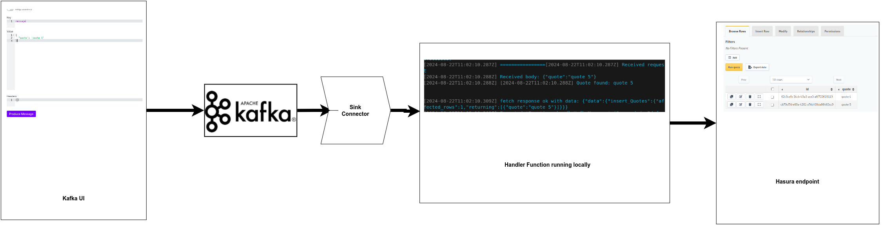

# Hasura Kafka POC
The aim is to demonstrate dataflow from Kafka topic to Postgres via Hasura and Azure functions

> [!NOTE]
> This is just a POC so env files are not added to gitignore

## Branches
There are multiple POC in different branches
- main branch - Kafka -> kafka connect -> Azure function(http trigger) -> Hasura -> PG DB
- direct_postgres_call branch - Kafka -> kafka connect -> Azure function(http endpoint) -> PG DB
- azure_kafka_trigger branch - Kafka -> Azure function(kafka trigger) -> PG DB

## Data flow


## Project Setup
### 1. Setup containers
Build the image for kafka connect
```
cd kafka-connect
docker build . -t kafka-connect-http:1.0.0
```
Run kafka, hasura, postgres with
```
docker compose up -d
```

### 2. Start azure function
In the azure functions folder rename **local.settings.sample.json** to **local.settings.json**  
Next Run azure function cli
```
cd azure-functions
npm install
npm run start
```
BASE URL will be http://172.17.0.1:7071/api when called from inside the container
> [!NOTE]
> Using 172.17.0.1 works in ubuntu. If you are using windows or mac try using **host.docker.internal**. 

### 3. Start hasura cli
Run hasura console cli (no admin secret set here)
```
cd hasura-metadata
hasura console --console-port 9500
```

### 3. Setup kafka connect connection
Modify the **http-sink.json** in *kafka-connect* folder
```
cd kafka-connect
curl -d @http-sink.json -H "Content-Type: application/json" -X POST http://localhost:8083/connectors
```

> [!NOTE]
> In **http-sink.json** I have used 172.17.0.1 to call the Azure function that runs outside the container ie., on the host, this works in ubuntu. If you are using windows or mac try using **host.docker.internal**. 

## Kafka UI
To create topics and messages via UI   
- Goto http://localhost:9010/   

## Running Hasura migration
Migration files for the demo are available.   
   
TBD

## Message Format
For the demo the message sent to kafka should be a json with key **quote**
```json
{
	"quote": "quote 1"
}
```

## OS and Versions
- Ubuntu 22.04  
- Node 18.19.1   
- npm 8.11.0  
- Azure func cli 4.0.5907  
- Hasura cli 2.40.0  